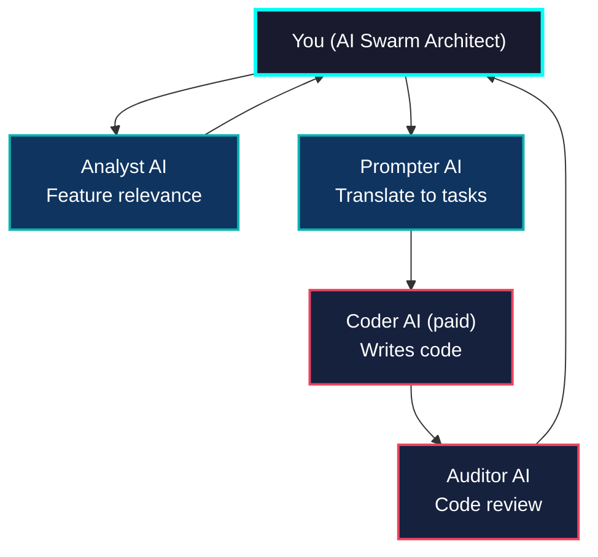

# 📡 Pslergy — Senior Product Engineer, Systems Architect & AI Swarm Architect

*"In an era of total surveillance, privacy is not a luxury — it’s a protocol."*

I am a **systems architect** and **developer** focused on creating **resilient and privacy-first technologies**. My work involves **designing and implementing systems** that continue to operate in **the most unstable environments**. I specialize in **decentralized solutions** and **mesh networks** that work without a constant internet connection, ensuring security even in the most challenging situations.

My philosophy is simple: **systems should adapt, not rely on external factors.**

---

## 🎯 **My Values and Approach**

- **Autonomy and Resilience:** I build systems that **don’t depend on the internet** or external infrastructure. They work where traditional systems fail.
- **Privacy:** Privacy is not an additional feature, it is the foundation of everything I do. My goal is to ensure that even in the harshest conditions, systems remain secure.
- **Solutions Based on Real Problems:** I solve specific problems, not theoretical ones. My work is aimed at making technology **actually solve problems** for people and organizations dealing with difficult conditions.

---

## 💻 **Skills and Expertise**

### **Technical Skills:**
- **Languages and Frameworks:** Dart (Flutter), Kotlin (Android), Python, JavaScript (Node.js), SQL  
- **Architectural Focus:** **Delay-Tolerant Networks (DTN)**, **Mesh Networking**, **Offline-First Systems**, **P2P Communication**  
- **Security:** Privacy-by-design, **E2EE (AES-256-GCM)**, Cryptography, Zero-trust Architecture  
- **Databases:** PostgreSQL, SQLite (WAL), ACID-Critical Systems  
- **Platforms and Tools:** Flutter, Android, AWS, Docker, Kubernetes, GCP, MQTT  
- **Additional Expertise:** **Signal Processing** (Acoustic Data Transfer), **P2P Protocols**, **TCP/IP**  

---

## 💡 **My Projects**

### **Memento Mori — Autonomous Shadow Mesh Infrastructure**

**A messenger for extreme conditions**.  
- **Hybrid Transport:** BLE signaling, Wi-Fi Direct data plane, Ultrasonic Sonar fallback  
- **Energy-Aware Orchestration:** Coordinated burst-mode networking for **maximum battery efficiency**  
- **Security:** E2EE (AES-256-GCM), Anti-forensic panic protocols, Ghost identity  
- **Architecture:** Delay-Tolerant Networking (DTN), Gossip relay, Offline-first consistency

---

### **Aryonika AI — AI-Powered Relationship Intelligence**

A full-scale consumer platform combining **AI**, **astronomy**, and **geospatial systems**.  
- **Scale:** Live in 8 languages, real users, production load  
- **Engine:** Python core powered by **Swiss Ephemeris** (NASA-grade astronomy)  
- **Matching:** Real-time proximity & compatibility using **PostGIS**  
- **AI Layer:** OpenAI-driven interpretation, personalization, and narrative synthesis

Built as a complete product: backend, data models, logic engine, and client integration.

---

## 🤖 My Methodology: AI Swarm Architecture

I don't write code line by line. I **architect systems and orchestrate a swarm of AI agents** to build production-ready applications 3–4× faster than traditional teams.

**How it works:**
- **Architect (Me)** – I design the system, define logic, choose tech stack, and control quality.
- **Coder AI ** – Writes clean, maintainable code based on my specs.
- **Prompter AI ** – Translates complex ideas into precise instructions for the coder.
- **Analyst AI ** – Monitors trends, suggests features, checks relevance.
- **Auditor AI ** – Reviews code for race conditions, security gaps, and tech debt.

This allows me to deliver **high-resilience, privacy-first systems** (like Memento Mori and Aryonika) in just months, with full architectural oversight and zero hand-coding. You get the speed of AI multiplied by senior engineering expertise.

## 🔧 **What I Offer**

- **Experience in mobile systems engineering**  
- **Expertise in creating autonomous offline-first applications**  
- **In-depth understanding of security and privacy**  
- **Full product ownership:** from concept to final implementation  
- **Ability to solve real-world problems by creating resilient and scalable systems**

---

## 🛠 **Technical Stack and Tools**

- **Languages:** Dart (Flutter), Kotlin, Python, SQL  
- **Tools:** AWS, Docker, Kubernetes, MQTT  
- **Technologies:** Mesh Networking, P2P, Offline-First, E2EE

---

## 📞 **Contact Information**

- **Email:** pslergy@gmail.com  
- **GitHub:** [github.com/pslergy](https://github.com/pslergy)

---

